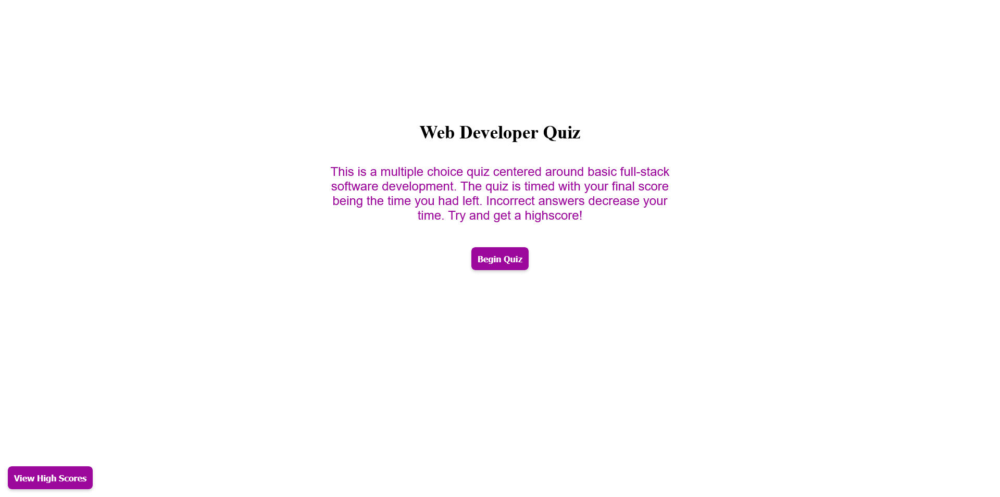

# developer-quiz

## Purpose
To create a timed multiple choice quiz that scores you on your performance. Then allow score and initials to be stored locally that can then be called to show a list of high scores. 

## Website
https://sam-clark1.github.io/developer-quiz/

## Screenshot

## Description
- Has a main menu that gives a description of how the quiz works and a button that begins the quiz
- Questions are stored in objects that are then stored in an array which can be called by an index number that increases by 1 to generate the next question.
    - Getting a question wrong decreases the time (which is also your score).
- Once quiz ends, the score is displayed and allows you to input your initials which is then stored locally along with your score
- Can look at all stored scores from clicking the "high score" button on main menu. 